# Robotics-EIE3
## Robotics Assignment 1:

### 5.2 Controller Tuning.

We used the script provided which gave us the difference between the projected motor position and actual motor position to give us an idea of how far off the motor was when rotating through a set number of degrees. For the purposes of the calibration, we ran a test of 60, 180 and 360 degrees. Once we had run these tests, we then uploaded the files to Github where we could then run them through MATLAB to generate the graphs.

In order to tune the controller, we first attempted to implement **Ziegler-Nichols** to provide a starting point for the tuning of the controller.

> Set ki and kd to zero. Increase kp until the system starts oscillating with period Pu (in seconds) — remember this gain as ku

> Set kp = 0.6 * ku , ki = 2kp / Pu , and kd = kp * Pu / 8

We increased the value of ku until we noticed that oscillations began to occur. We found this value to be around 750. That gave us values of 450 for kp. From the oscillation period we calculated kd to be 229 and ki to be 120.

When we then looked at the oscillations for these new values we found them to be better than the original but still requiring further refinement. We did this manually by changing the value of ki until we felt it best matched the actual curve.

Measurement 1: kp = 750, kd = 0, ki = 0
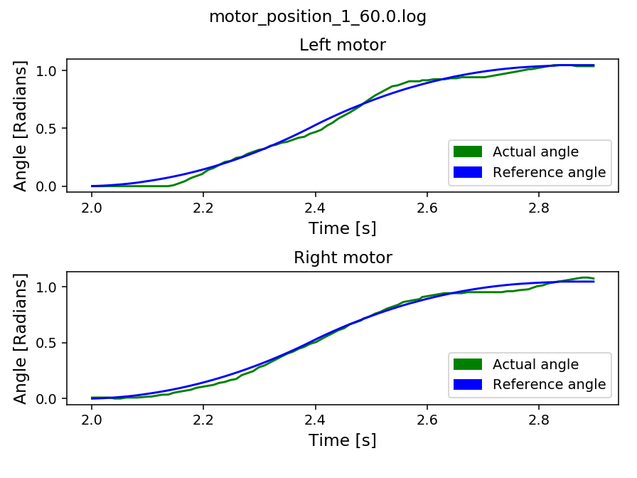
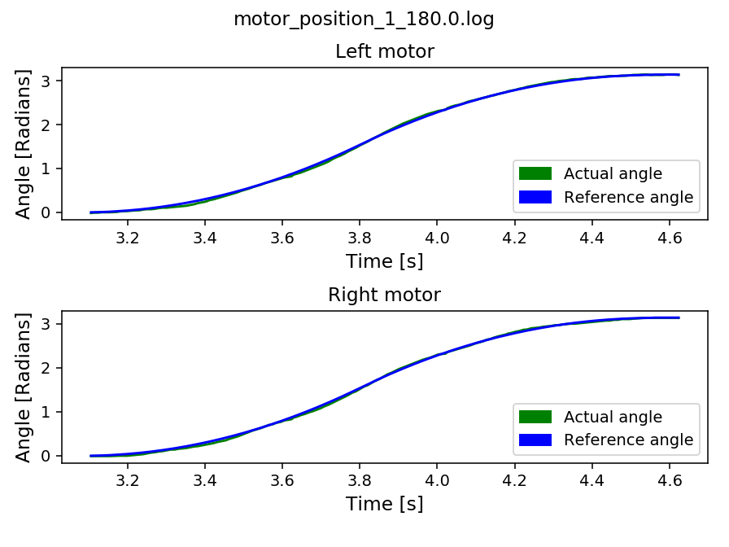

Measurement 2: kp = 450, kd = 229 ki = 0
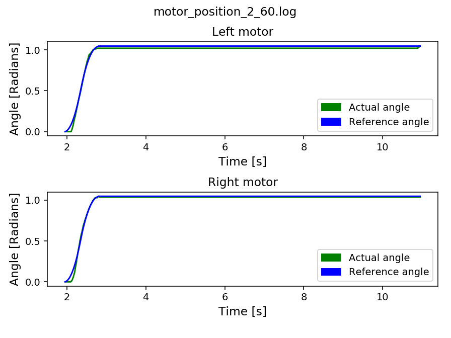
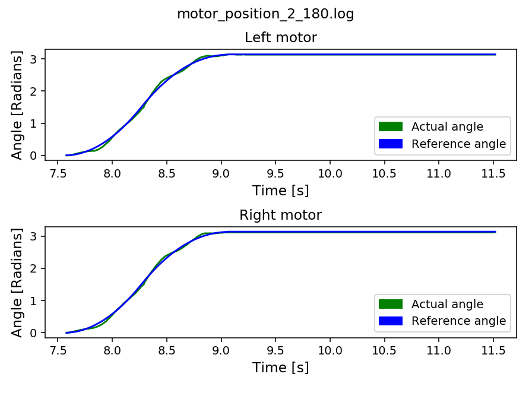

Measurement 3: kp = 450, kd = 229 ki = 120
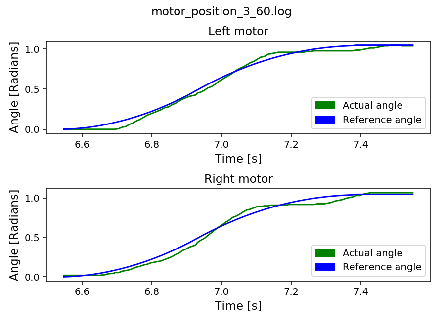
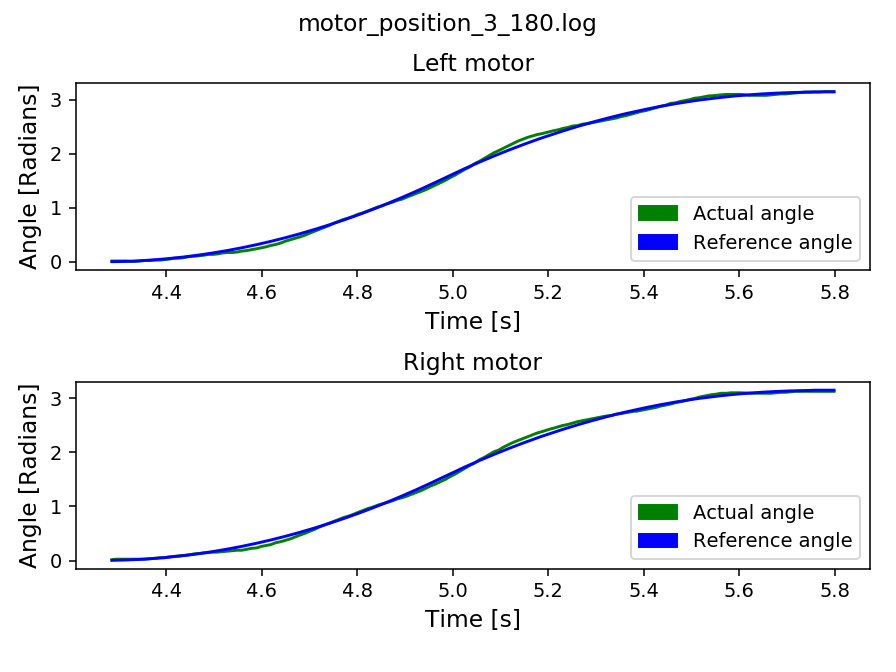

Measurement 4: Left: kp = 450, kd = 229 ki = 170 Right: kp = 450, kd = 229 ki = 200
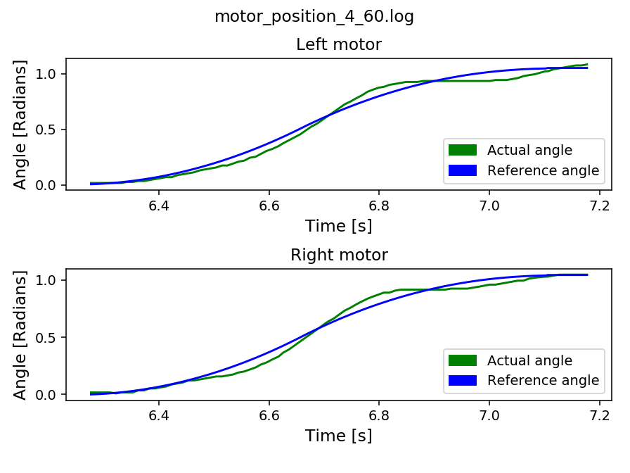
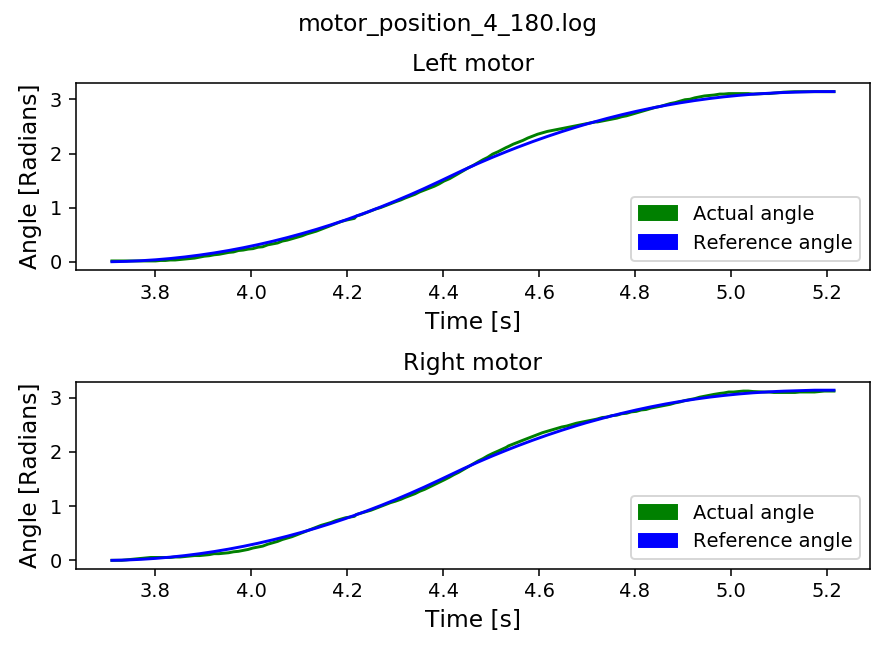
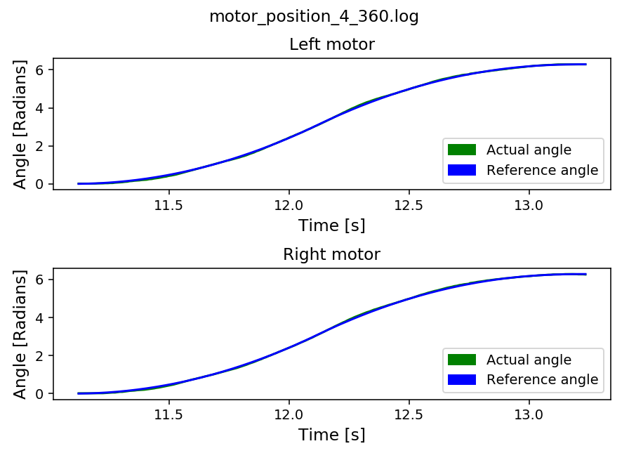

Measurement 5: Left: kp = 450, kd = 229 ki = 200 Right: kp = 450, kd = 229 ki = 225

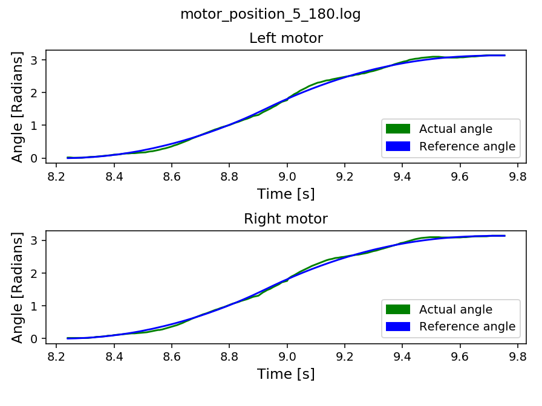

Measurement 6: Left: kp = 450, kd = 229 ki = 160 Right: kp = 450, kd = 229 ki = 190
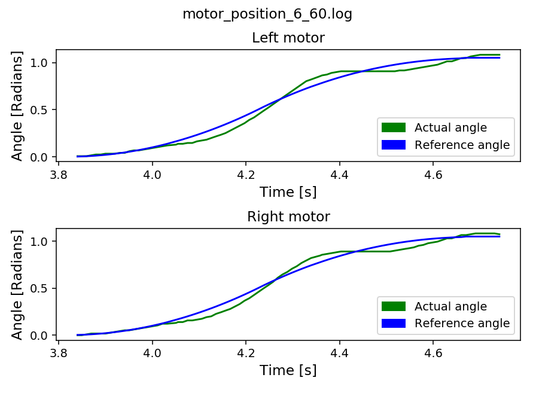
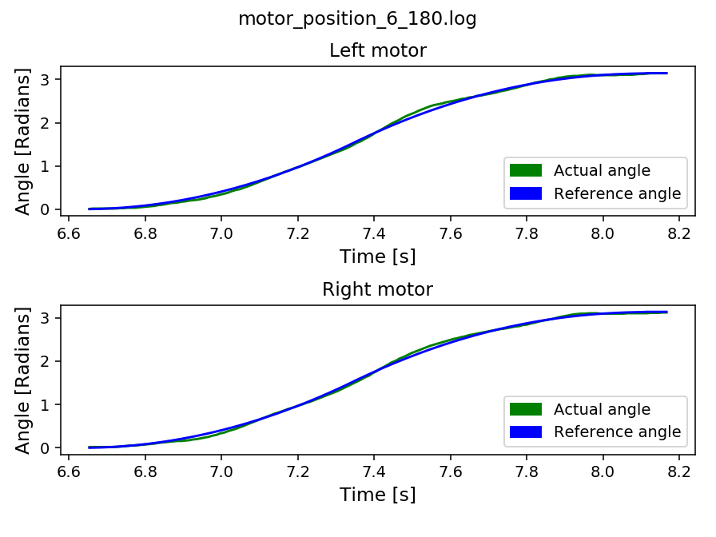

As you can see from the images, we managed to from large oscillations to an almost perfect curve.

### 5.3 Distance and Rotation Calibration

To calibrate the distance, we measured the diameter of the wheel. This would tell us how far the robot would move when the motor rotated through a set angle. We tested this out and found we needed to adjust this value slightly to account for small inconsistencies such as the tyre changing diameter when the weight of the robot was on it. After a small trial and error session we were able to accurately make the robot move the distance we would tell it.

### 5.4 Driving in a Square and Observing Drift

#### Driving recording
[https://youtu.be/rqx-CMewXA0](https://youtu.be/rqx-CMewXA0)

#### Drift logs
|  X-axis | Y-axis  |
|:-------:|:-------:|
|-0.7     |0.5     |
|-0.4     |0.5        |
|-0.1     |0.5      |
|0.5      |0.3     |
|0.9      |-0.1       |
|1.1      |-0.2     |
|1.5      |-0.1    |
|1.7      |-0.3     |
|1.6      |-0.5       |
|1.8      |-0.9       |

### 5.5 Covariance Matrix
Once we were happy with how our robot was performing we then went about calculating the covariance matrix based upon the finishing position of the robot over 10 squares. We obtained the following matrix:

|    |X           |Y           |
|----|------------|------------|
|X   | 0.94277778 |-0.42388889 |
|Y   | -0.42388889|0.22677778  |

Our caulculated mean of X is `-0.75` and mean of Y is `0.3`

A Covariance Matrix allows us to clearly see the variance we observed in our x and y values along with the covariance between x and y. In our case the variance of `X` is `0.94277778`, the variance of `Y` is `0.22677778` and the covariance is `-2.94`.

### Further Thought:

#### What causes a larger effect in your robot, Uncertainty in drive distance or rotation angle?

For our robot, we believe that the rotation angle introduces a larger uncertainty as on measuring the lines we found them to all be roughly the same length. However if the robot was a few degrees off in it’s turn these quickly added up to create very distorted squares.

#### Can you think of any robot designs which will be able to move more precisely?

A number of things could be done to improve precision. Firstly we could reverse the robot so that the driving wheels were “dragging” the caster rather than “pushing” it. This would reduce the amount of drift in a line as the caster would help to keep the wheels in check when it is being dragged whilst it has the temptation to wander whilst being pushed. This is similar to how your car is much more stable driving forward but has a larger turning circle than when you try and reverse it.

We could also reduce the size of the wheels. By fitting smaller wheels we would slow the motion of the robot as it would travel a shorter distance in one revolution, but we would be able to make it travel a far more precise distance.

#### How should we go about equipping a robot to recover from the motion drift we have observed in this experiment?

Firstly we could ensure that the paper is as flat as possible so this had no effect on the steering of the robot. (Though this would be very difficult to achieve in a real world scenario). Another option would be to fit a sensor which would be able to lock onto a fixed point in the room and measure the distance to that item. By comparing this distance as the robot moves with the value the robot would expect it to be, the robot can observe if it is drifting off-course. This would require a complex sensor however such as a LIDAR with intensive behind-the-scenes processing to enable this feature.
